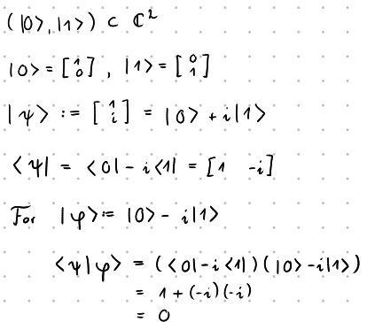

# Vorlesung 2

\newtheorem{theorem}{Theorem}[section]
\newtheorem*{theorem*}{Theorem}
\newtheorem{proposition}[theorem]{Proposition}
\newtheorem{korollar}[theorem]{Korollar}
\newtheorem{lemma}[theorem]{Lemma}
\theoremstyle{definition}
\newtheorem{definition}[theorem]{Definition}
 
\begin{definition}
    $F\in L(V,W)$ can be represented by a matrix $A\in C^{n\times m}$
    with $n=\dim V$ and $m=\dim W$
    when basises are chosen.
\end{definition}

\begin{definition}[Complex Hilbert space]
    A complete (every cauchy sequence converges)
    complex vector space $\mathcal{H}$ with a sequilinear inner product
    $$ \langle \cdot, \cdot \rangle : \mathcal{H} \times \mathcal{H} \rightarrow \mathbb{C}$$
\end{definition}

\begin{definition}
    A Basis $(e_1, \dots, e_n) \subset \mathcal{H}$ with
    $$\langle e_i, e_j \rangle = \delta_{ij}$$
\end{definition}

\begin{definition}
    We define the dual space
    $$\mathcal{H}^* = \{f:\mathcal{H} \overset{linear}{\to} \mathbb{C}\}$$
\end{definition}

\begin{definition}
    \[\begin{aligned}
        \mathcal{H}^* &= \{f:\mathcal{H} \overset{linear}{\to} \mathbb{C}\} \\
        &= \{\langle x,\cdot \rangle | x \in \mathcal{H}\}
    \end{aligned}\]
\end{definition}

We will use the [bra-ket notation](https://en.wikipedia.org/wiki/Bra%E2%80%93ket_notation):

\begin{definition}[bra-ket Notation]
    $\varphi, \psi \in \mathcal{H}$:
    \[\begin{aligned}
        \varphi &= | \varphi \rangle \in \mathcal{H} & \text{bra} \\
        \langle \varphi , \cdot \rangle &= \langle \varphi | \in L(\mathcal{H}) & \text{ket} \\
        \langle \varphi , \psi \rangle &= \langle \varphi | \psi \rangle
    \end{aligned}\]
\end{definition}

\begin{definition}[Rank-1 operators]
    Let $| \psi \rangle, | \varphi \rangle\in \mathcal{H}$
    The "\textit{Outer product}" acts on $| \eta \rangle\in \mathcal{H}$
    as
    $$ (| \psi \rangle \langle \varphi |)(| \eta \rangle) = | \psi \rangle \langle \varphi | \eta \rangle$$
\end{definition}

\begin{definition}[self-adjoint operators, aka. Hermitian operators]
    $$\text{Herm}(\mathcal{H}) = \{ A \in L(\mathcal{H}) | A^\dagger = A\}$$
\end{definition}

\begin{definition}[unitary operators]
    $$U(\mathcal{H}) = \{ A \in L(\mathcal{H}) | A^\dagger = A^{-1}\}$$
\end{definition}

\begin{definition}[normal operators]
    $$\{ A \in L(\mathcal{H}) | A^\dagger A = A A^\dagger\}$$
\end{definition}

\begin{proposition}
    $A\in L(\mathcal{H})$ ist \textit{diagonalizable} if there is a
    basis of eigenvectors
\end{proposition}
